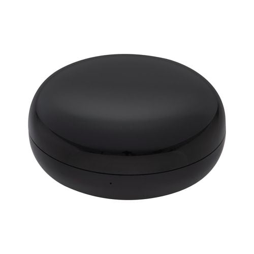

Sold at Bunnings in Australia. Model number HUBIR01HA. Based on the CB3S module, natively runs Tuya.

This configuration provides climate control but the device is a generic IR blaster that can control a wide range of IR devices.

Flashing is achieved by popping off the top cover and soldering to easily accessible pads for UART.
tuya-cloudcutter is untested - it may work but it's quite an easy device to flash by serial.

## GPIO Pinout

| Pin    | Function              |
| ------ | --------------------- |
| P6 | Reset button (active low) |
| P7 | IR Receiver |
| P8 | Status LED |
| P26 | IR Blaster Output |

## Flashing

- Open the blaster by prising off the translucent top - it's not glued or welded but does have a fair few clips holding it together
- Solder wires to the pads for 3V3, RST, TX, RX, and GND
- Connect 3V3, TX, RX, and GND to your USB UART adapter, and RST to GND (temporarily)
  - Note that if you have trouble flashing you may need to source a reliable 3.3V supply from some other place
- Generate a UF2 firmware file with ESPHome and flash using https://docs.libretiny.eu/docs/flashing/tools/ltchiptool/ - once you've clicked Start, disconnect RST from GND
  - This can take a few goes sometimes
- Once flashed, disconnect the wires and power from USB - any further updates you need to make can be done OTA (which is usually much faster)
- Take care when replacing the top - the clips aren't evenly spaced so you'll need to line them up right for it to go back together

## Example Configuration for Climate Control

```yaml
substitutions:
  device_name: "bedroom-aircon"
  friendly_name: "Bedroom Aircon"

esphome:
  name:  ${device_name}
  friendly_name:  ${friendly_name}
bk72xx:
  board: cb3s

logger:

api:

ota:

wifi:
  ssid: !secret wifi_ssid
  password: !secret wifi_password

  # Enable fallback hotspot (captive portal) in case wifi connection fails
  ap:
    ssid: ${device_name}
    password: "password"

captive_portal:

light:
  - platform: status_led
    name: "Status"
    pin: P8

remote_transmitter:
  pin: P26
  carrier_duty_percent: 50%

# Receiver allows the original remote to be used and HA to follow along
remote_receiver:
  id: rcvr
  pin:
    number: P7
    inverted: true
    mode:
      input: true
      pullup: true
  tolerance: 55%

# If you have a temperature sensor in the room, reference it here for the current temperature to be shown in the blaster's climate entity
#sensor:
#  - platform: homeassistant
#    id: current_temperature
#    name: "Temperature from HA Sensor"
#    entity_id: sensor.bedroom_climate_temperature

# See https://esphome.io/components/climate/climate_ir for list of manufacturers
climate:
  - platform: fujitsu_general
    name: ${friendly_name}
    receiver_id: rcvr
    #sensor: current_temperature
```
